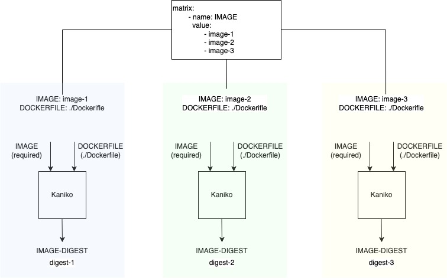
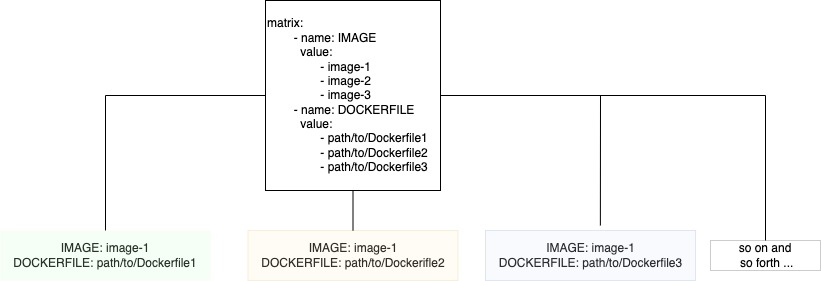

# TEP-0115: Matrix with Explicit Combination of Inputs

<!-- toc -->
- [Summary](#summary)
- [Motivation](#motivation)
  - [Goals](#goals)
  - [Non-Goals](#non-goals)
  - [Use Cases](#use-cases)
  - [Requirements](#requirements)
- [Proposal](#proposal)
  - [Notes and Caveats](#notes-and-caveats)
- [Design Details](#design-details)
- [Design Evaluation](#design-evaluation)
  - [Reusability](#reusability)
  - [Simplicity](#simplicity)
  - [Flexibility](#flexibility)
  - [User Experience](#user-experience)
  - [Performance](#performance)
  - [Risks and Mitigations](#risks-and-mitigations)
  - [Drawbacks](#drawbacks)
- [Alternatives](#alternatives)
- [Implementation Plan](#implementation-plan)
  - [Test Plan](#test-plan)
  - [Infrastructure Needed](#infrastructure-needed)
  - [Upgrade and Migration Strategy](#upgrade-and-migration-strategy)
  - [Implementation Pull Requests](#implementation-pull-requests)
- [References](#references)
<!-- /toc -->

## Summary

[TEP-0090](0090-matrix.md) introduced `Matrix` to the `PipelineTask` specification such that the `PipelineTask`
executes a list of `TaskRuns` in parallel with the specified list of inputs for a `param` or with different combinations of
the inputs for a set of `params`.

There was one important aspect overlooked - limiting Matrix to a specific combination of inputs.

Let's take an example of the same [kaniko][kaniko-task] `Task` from the  *Tekton Catalog*. In case when a pipeline
author would like to build three images from a single repository using `Matrix`:

```yaml
apiVersion: tekton.dev/v1beta1
kind: Pipeline
metadata:
  name: pipeline-to-build-images-from-a-single-repo
spec:
  workspaces:
    - name: shared-workspace
  tasks:
    ...
    - name: kaniko-build
      taskRef:
        name: kaniko
      workspaces:
        - name: source
          workspace: shared-workspace
      matrix:
        - name: IMAGE
          value: [ "image-1", "image-2", "image-3" ] 
```

In this example, [Kaniko](https://github.com/tektoncd/catalog/blob/main/task/kaniko/0.5/kaniko.yaml) `Task` will be
executed with three different `IMAGE` values but with the same default value of the `DOCKERFILE` which is `./Dockerfile`.



This is not a desired outcome for this use case. The pipeline author intended to create three separate images using three separate
Dockerfiles.

Further, following the `Matrix` syntax, as a Pipeline author, adding `DOCKERFILE` into `matrix`:

```yaml
apiVersion: tekton.dev/v1beta1
kind: Pipeline
metadata:
  name: pipeline-to-build-multiple-images
spec:
  workspaces:
    - name: shared-workspace
  tasks:
    ...
    - name: kaniko-build
      taskRef:
        name: kaniko
      workspaces:
        - name: source
          workspace: shared-workspace
      matrix:
        - name: IMAGE
          value: [ "image-1", "image-2", "image-3" ] 
        - name: DOCKERFILE
          value: [ "path/to/Dockerfile1", "path/to/Dockerfile2", "path/to/Dockerfile3" ] 
```

Matrix by design with multiple parameters calculates all the possible combinations of those inputs and executes an
instance of `PipelineTask` with each combination.

Now, this specification of the `Matrix` creates 9 different combinations, such as:



This is not a desired outcome either. We need a way to specify explicit mapping between `IMAGE` and `DOCKERFILE`:

```go
    - IMAGE: "image-1"
      DOCKERFILE: "path/to/Dockerfile1

    - IMAGE: "image-2"
      DOCKERFILE: "path/to/Dockerfile2"

    - IMAGE: "image-3"
      DOCKERFILE: "path/to/Dockerfile3"
```

## Motivation

A `task` in the Tekton catalog is designed to be shared and reusable across the pipelines. A `task` must be 
designed to solve a single unit of execution which relies on one or more parameters. Some of these parameters signify the key
information to execute this kind of `task`. For example, [Kaniko](https://github.com/tektoncd/catalog/blob/main/task/kaniko/0.5/kaniko.yaml)
task in a catalog defines one required parameter, `IMAGE` and an optional parameter, `DOCKERFILE`, along with many others.
Kaniko `task` builds source into a container image using the Dockerfile specified in `DOCKERFILE`.

Pipeline authors often require to include the same `task` to be executed with a set of input values. `Matrix` has
helped pipeline authors to simplify their pipelines by allow them to specify variations for executing a `task`.

The motivation of this TEP is to extend `matrix` to allow pipeline authors to further specify the combination of `params`.

### Goals


### Non-Goals


### Use Cases


### Requirements

## Proposal


### Notes and Caveats


## Design Details


## Design Evaluation

### Reusability


### Simplicity


### Flexibility


### Conformance


### User Experience


### Performance


### Risks and Mitigations


### Drawbacks


## Alternatives


## Implementation Plan


### Test Plan


### Infrastructure Needed


### Upgrade and Migration Strategy


### Implementation Pull Requests


## References

